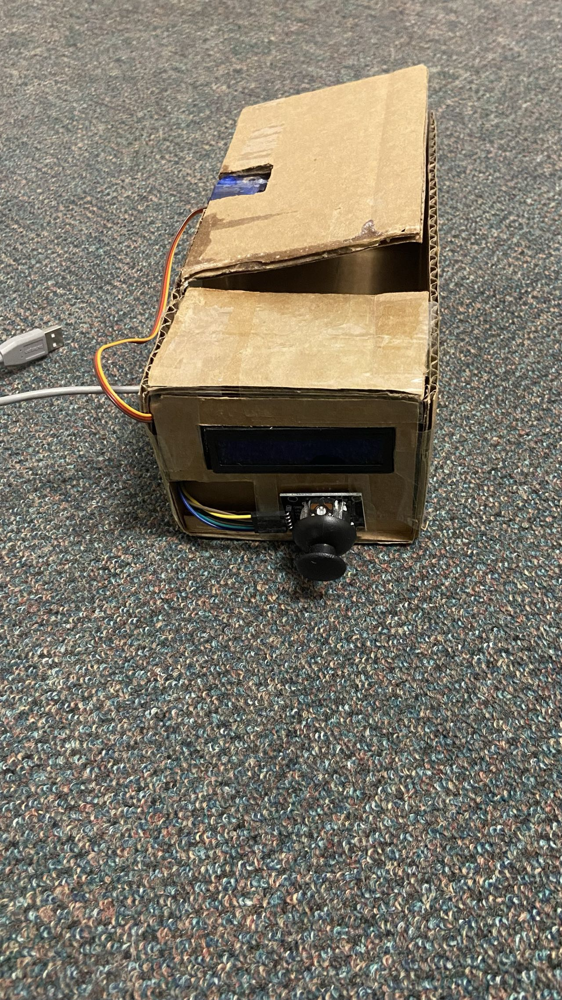

The main purpose of this design is to help people control their daily use of mobile phones. 
Users just need to set the time and put the phone into the box to lock the phone. And in order to take care of the user's urgent needs, 
the user can unlock the lock twice before the countdown ends.

.png)
.png)
